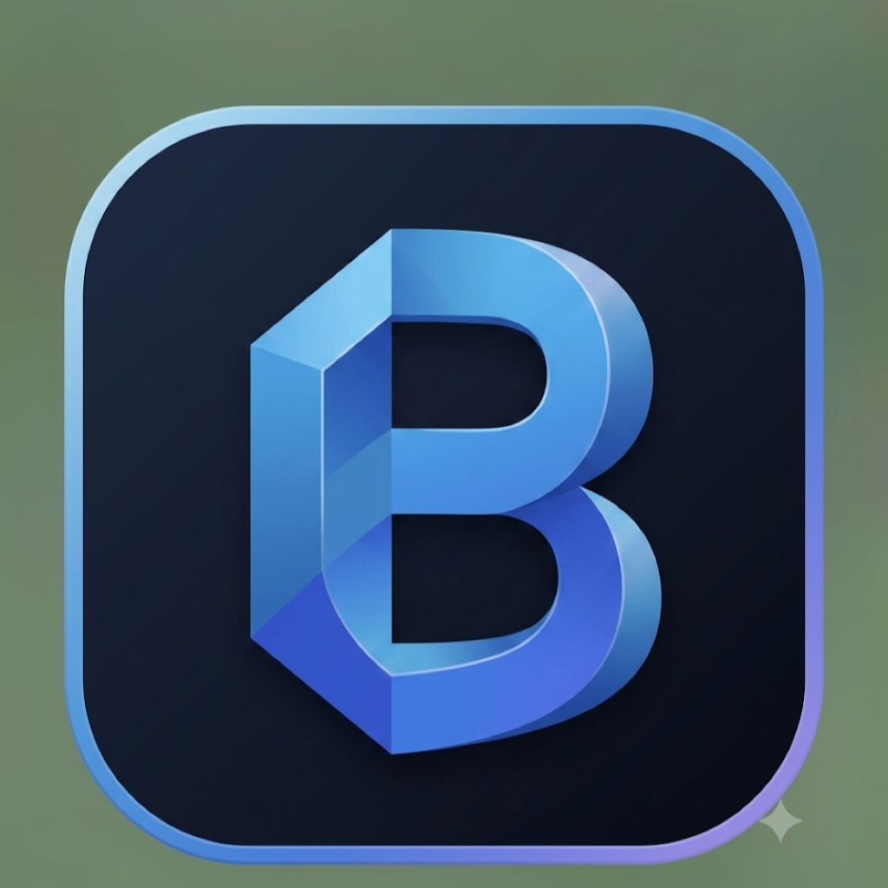

<div align="center">
  

  # BsCode

  **A living desktop for coordinating Codex, Claude, and shell agents.**

  Local and SSH workspaces · Four live agents · Cinematic scenes · Pixel tower

  [](https://github.com/axel-slid/agent-workbench/releases/tag/v0.2.0)
  [](https://github.com/axel-slid/agent-workbench/releases/latest)
  [](https://www.electronjs.org/)
  [](tests/run.mjs)

  [Download](https://github.com/axel-slid/agent-workbench/releases/latest) ·
  [Feature reference](docs/features.md) ·
  [Build guide](docs/cross-platform.md) ·
  [Release notes](docs/release-v0.2.0.md)
</div>

---


BsCode turns one project into a coordinated multi-agent workspace. Run four
independent terminals, monitor concise progress in Zen view, inspect their
outputs, or step into a visual tower where every agent has a floor and a pet.
Local and remote workspaces use the same tabs, files, notes, outputs, and agent
metadata.

## What makes 0.2 different

| Surface | What it does |
| --- | --- |
| **Agent wall** | One, two, or four Codex, Claude, or shell PTYs with live model, state, task, ETA, checklist, and files |
| **Cinematic Mode** | True full-screen four-pane view over 20 credited, artist-made 1080p animated landscapes with `⌘K`, `@mentions`, Results, scene shuffle, and synchronized pane resizing |
| **Pixel Mode** | A 20-floor Art Deco tower with premade previews, diverse rooms, time-of-day skies, agent clipboard navigation, and clickable RPG pet stats |
| **Workspace Notes** | Notes, todos, and a sketch canvas saved beside the project so agents can read the same plan |
| **Home** | Fast return to recent local and SSH workspaces; immersive modes stay disabled until a workspace is open |
| **Files + Outputs** | Live Explorer, remembered opened outputs, generated-file attribution, and embedded image, video, PDF, HTML, code, and document previews |

## Highlights

- Native local and SSH terminals powered by `node-pty` and xterm.js.
- Deterministic human agent names and pixel portraits.
- A Slack-style `@` picker for models, numbered panes, and named live agents.
- Zen/bullet mode where `Enter` reliably sends a follow-up and `Shift+Enter`
  inserts a newline.
- Live current-task row, normalized checklist state, and countdown ETAs.
- Workspace tabs with running-agent portraits and optional live ETA labels.
- Disconnected SSH workspaces clear stale files and show their state plainly.
- Local or remote disk usage in the bottom bar.
- Spotify playback and shuffle controls, plus optional music-reactive scene
  atmosphere with adjustable strength.
- Searchable Openleaf theme catalog with 22 choices in each of seven
  categories.
- macOS clock, clickable calendar, battery meter, and charging bolt.
- Command-palette **Copy workspace handoff** action for an instant Markdown
  standup of every live agent.

## Pixel Mode


The tower bundles 20 premade floor-preview PNGs; opening a tab never drives the
hidden room iframe through every floor. Rooms vary by size, shape, materials,
palette, furniture, and floor plan. Each occupied floor hosts one live agent
and a species-specific pet.

Click a pet to open a pixel RPG sheet with:

- HP and energy bars
- level and mood
- favorite food
- hobbies
- personality trait
- special talent

Click an agent in the clipboard to jump straight to its floor. The tower sky
defaults to local sunrise, day, sunset, or night and can be cycled manually.

## Cinematic Mode

Press `⌘K` (`Ctrl+K` elsewhere) to enter full screen and focus the shared
command dock. All four panes remain visible even when no agents are running.
Type `@` to route a message to:

- `@codex`, `@claude`, or `@shell`
- `@1` through `@4`
- any running agent by name

The 20 bundled scenes are credited, artist-made CGI and Blender animations.
They are locally cached 1080p loops—not AI-generated art, live-action footage,
or artificial pans across still images. Only the selected scene is decoded;
the other 19 remain dormant. Enable Reduce Motion or opt into
Spotify-reactive atmosphere. Full credits and source licenses are recorded in
[`assets/scenes/README.md`](assets/scenes/README.md).

## Workspace Notes

The Notes button opens a focused Apple Notes-inspired workspace with:

- free-form notes
- checkable todos
- a pressure-free sketch pad with color and brush size

BsCode persists the structured data in `.bscode-notes.json` and an agent-readable
summary in `.bscode-notes.md`. SSH workspaces write the same files remotely.

## Install

### macOS Apple Silicon

1. Download `BsCode-macOS-arm64.zip` from the
   [latest release](https://github.com/axel-slid/agent-workbench/releases/latest).
2. Unzip it and drag `BsCode.app` to Applications.
3. Open BsCode and choose a local folder or SSH workspace.

BsCode 0.2 is packaged natively for `arm64`.

### Run from source

Requirements: Node.js 22.12+, npm 10+, and at least one supported CLI
(`codex`, `claude`, or a shell).

```bash
npm ci
npm run dev
```

Validate all source, packaging rules, and 42 regression checks:

```bash
npm run check
npm test
```

The release is also checked through the screenshot-driven matrix in
[`docs/visual-qa.md`](docs/visual-qa.md), including light/dark, active/idle,
Home, Notes, Settings, Pixel, Cinematic, desktop, tablet, and phone states.

Package for the current system:

```bash
npm run package:current
```

Target-specific entry points are `npm run package:mac`,
`npm run package:windows`, and `npm run package:linux`. Native binaries mean
each target must be built on its own operating system.

## Keyboard map

| Shortcut | Action |
| --- | --- |
| `⌘/Ctrl+P` | Command palette |
| `⌘/Ctrl+K` | Enter Cinematic Mode and focus the command dock |
| `⌘/Ctrl+1…4` | Focus an agent |
| `⌘/Ctrl+Alt+Z` | Toggle Zen view for every agent |
| `⌘/Ctrl+Shift+Space` | Pause or resume all agents |
| `⌘/Ctrl+Shift+A` | Ask all agents for status |
| `⌘/Ctrl+Shift+R` | Retry failed agents |
| `Enter` | Start an empty agent or send a Zen follow-up |
| `Shift+Enter` | Newline in a task or follow-up |
| `Escape` | Close the active overlay or immersive mode |

## Architecture

```text
Renderer UI
   │  narrow window.agentWorkbench API
   ▼
Context-isolated preload
   │  validated IPC
   ▼
Electron main process
   ├── local + SSH filesystem
   ├── PTY and agent lifecycle
   ├── metadata watchers
   ├── notes and output services
   ├── system, storage, battery, and Spotify status
   └── native windows and notifications
```

`contextIsolation` and Electron sandboxing stay enabled; Node integration is
disabled in the renderer.

## Security note

BsCode intentionally starts Codex with
`--dangerously-bypass-approvals-and-sandbox` and Claude with
`--dangerously-skip-permissions`. Agents therefore receive broad access to the
selected workspace. Use trusted workspaces and review `createAgent` in
`main.js` before changing the permission model.

## Documentation

- [Complete feature breakdown](docs/features.md)
- [v0.2.0 release notes](docs/release-v0.2.0.md)
- [Cross-platform build and smoke-test guide](docs/cross-platform.md)
- [Visual QA and release matrix](docs/visual-qa.md)
- [Pixel Agents integration](pixel-agents-mode/AGENT-WORKBENCH-INTEGRATION.md)

<div align="center">
  Built for people who would rather direct a small studio than stare at one terminal.
</div>
