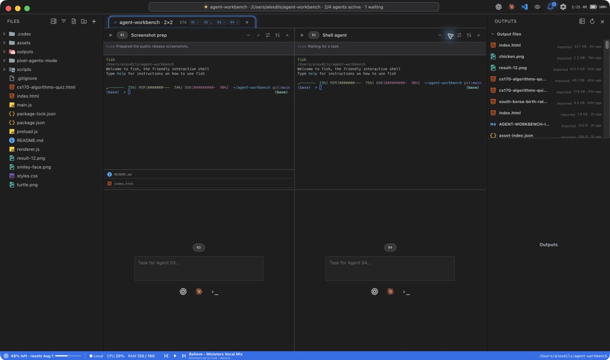
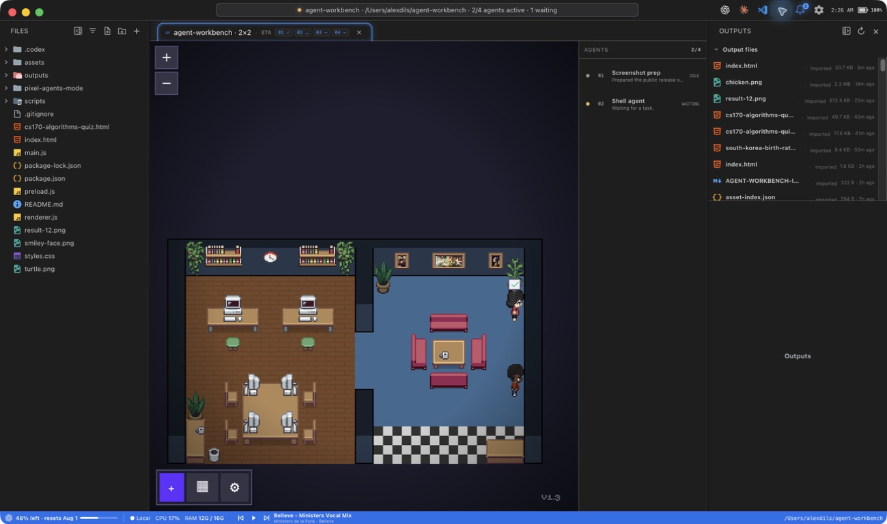

# Agent Workbench

A macOS Electron workspace for running and organizing Codex, Claude, and shell
agents in a VS Code-inspired 2×2 interface.



## Highlights

- Four independent agent terminals with self-reported names, TLDRs, ETAs, and relevant files
- Local and SSH workspaces in persistent tabs
- Explorer and output panes with resizable or fully collapsible sidebars
- Embedded previews for images, HTML, PDFs, code, and generated artifacts
- Live CPU, memory, NVIDIA GPU, battery, Codex usage, and Spotify status
- Openleaf theme catalog shared across the application and terminals
- Command palette, workspace context menus, and `⌘1`–`⌘4` agent navigation
- Native notifications and an unread bell when an agent finishes
- Pixel Mode with idle/working characters, mouse pan/zoom, and a live agent roster



## Run locally

Requirements: macOS, Node.js, and at least one supported CLI (`codex`,
`claude`, or a shell).

```bash
npm install
npm run dev
```

Build the macOS application:

```bash
npm run package:mac
open "dist/mac/Agent Workbench.app"
```

Agent Workbench launches Codex with its approvals and sandbox bypass flag.
Review the launch configuration in `main.js` before using untrusted
workspaces.

## Agent metadata

Each agent receives a private metadata path under Electron's user-data
directory and updates it with:

```json
{
  "name": "Short task-specific name",
  "tldr": "One sentence describing current progress.",
  "status": "working",
  "etaMinutes": 3,
  "relevantFiles": ["relative/path/to/output.png"],
  "previewFile": "relative/path/to/output.png"
}
```

The renderer watches this file to keep names, TLDRs, countdowns, notifications,
Pixel Mode, and output previews in sync.

## Pixel Mode

Pixel Mode embeds the open-source
[Pixel Agents](https://github.com/pixel-agents-hq/pixel-agents) webview under
its MIT license. Scroll to pan, use `⌘`/`Ctrl` + scroll or the `+`/`−` controls
to zoom, and middle-drag to pan directly.
